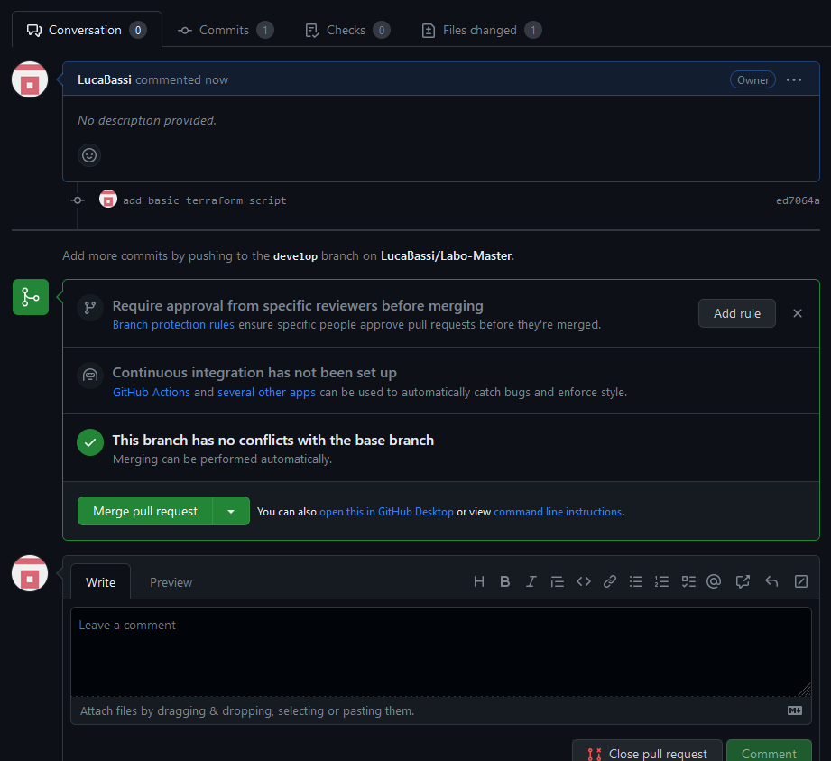

# Fork process

[Source](https://docs.github.com/en/get-started/quickstart/fork-a-repo)

<figure><figcaption><p>Git-flow scenario to master</p></figcaption></figure>

* [ ] Fork the "upstream" repository in your github organisation

```
//TODO
Screenshot of Github
```


* [ ] Clone "teacher" repo in your local machine

```
[INPUT]
git clone git@github.com:LucaBassi/Labo-Master.git

[OUTPUT]
$ ls 
$ LABO-MASTER
```

* [ ] Init Git flow (with standard settings)

```
[INPUT]
git-flow init

[OUTPUT]
$ git branch 
* develop
  main

```

* [ ] Integrate updates from upstream (main) into your repository (develop)

```
[INPUT]
git checkout develop
git pull origin main

[OUTPUT]
 * branch            main       -> FETCH_HEAD
Updating 65402b5..35e8589
Fast-forward
 labo-01-git-flow/ReadMe.md | 2 ++
 1 file changed, 2 insertions(+)
 create mode 100644 labo-01-git-flow/ReadMe.md

```

* [ ] Create a branch feature called "terraformBasicScript"

```
[INPUT]
git flow feature start terraformBasicScript

```

* [ ] Add this code and commit it (feat:add basic terraform script")

```
terraform {
  required_providers {
    aws = {
      source  = "hashicorp/aws"
      version = "~> 4.16"
    }
  }

  required_version = ">= 1.2.0"
}

provider "aws" {
  region  = "us-west-2"
}

resource "aws_instance" "app_server" {
  ami           = "ami-830c94e3"
  instance_type = "t2.micro"

  tags = {
    Name = "ExampleAppServerInstance"
  }
}
```

```
[INPUT]
git add .
git commit -m "add basic terraform script"

[OUTPUT]
[feature/terraformBasicScript ed7064a] add basic terraform script
 1 file changed, 1 insertion(+), 1 deletion(-)
```

* [ ] Finish the feature

```
[INPUT]
git flow feature finish terraformBasicScript

[OUTPUT]
Switched to branch 'develop'
Your branch is up to date with 'origin/develop'.
Updating 0f66467..ed7064a
Fast-forward
 labo-01-git-flow/script.sh | 2 +-
 1 file changed, 1 insertion(+), 1 deletion(-)
Deleted branch feature/terraformBasicScript (was ed7064a).

Summary of actions:
- The feature branch 'feature/terraformBasicScript' was merged into 'develop'
- Feature branch 'feature/terraformBasicScript' has been locally deleted
- You are now on branch 'develop'
```

* Push this modification on your repository

```
[INPUT]
git push

[OUTPUT]
Enumerating objects: 7, done.
Counting objects: 100% (7/7), done.
Delta compression using up to 4 threads
Compressing objects: 100% (4/4), done.
Writing objects: 100% (4/4), 387 bytes | 387.00 KiB/s, done.
Total 4 (delta 2), reused 0 (delta 0), pack-reused 0
remote: Resolving deltas: 100% (2/2), completed with 2 local objects.
To github.com:LucaBassi/Labo-Master.git
   0f66467..ed7064a  develop -> develop
```

* What happens to the feature/branch ?
feature branch is deleted after usage
```

//TODO
Add your answer with command line used to validate your analysis.

git branch
```

* Open a pull request comparing your develop branch to your main
* Assign the pull request to your partner

```
//TODO
Screenshot pull request on github
```

* Notify him using a issue "Could you please review my pull request ?"

```
//TODO
Screenshot issue on github
```
